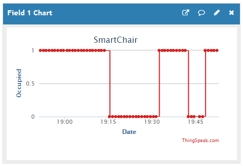
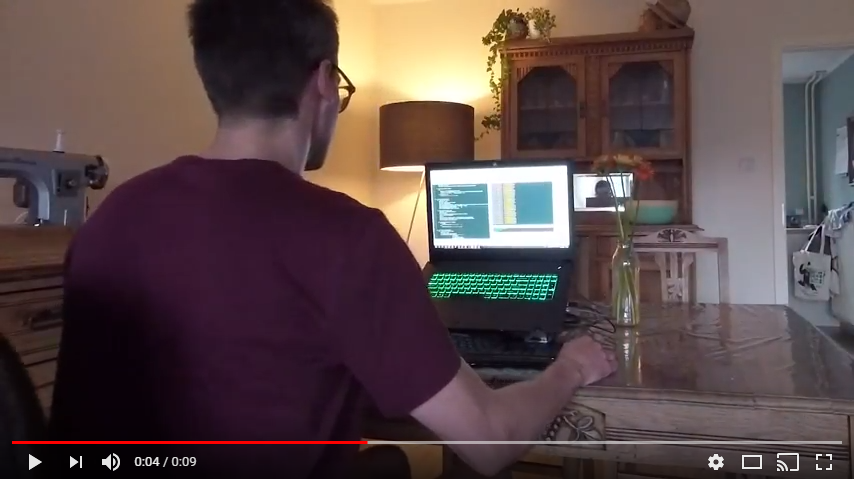

# SmartChair
A quick IoT project: Chair + Presence detection = SmartChair

## Getting started
### Hardware
* [M5Stack](http://m5stack.com/) - The brain (Based on the [ESP32](https://en.wikipedia.org/wiki/ESP32))
* [HC-SR04](img/HC-SR04-Ultrasonic-Sensor.jpg) - Ultrasonic rangefinder for presence detection (A pressure sensor might be less noticeable :sweat_smile:)

### Software
* [ESPlorer](https://esp8266.ru/esplorer/) - IDE (Development done in MicroPython)
* [LoBo MicroPython](https://github.com/loboris/MicroPython_ESP32_psRAM_LoBo) - Firmware for the ESP32

## Installing
The source files are located in the 'src' folder. [boot.py](src/boot.py) is executed first. This will set up the WiFi connection. [main.py](src/main.py) will run afterwards. You will have to create an extra file [myconfig.py](src/myconfig.py) with some configuration. Example:

'''python
wifi_ssid = 'MyWiFi'
wifi_psk = 'wifi123'

timezone = 'CET-1CEST'
 
hassio_mqtt_user = 'hassio'
hassio_mqtt_pwd = 'hassio123'

thingspeak_mqtt_user = 'thingspeak'
thingspeak_mqtt_pwd = 'thingspeak123'
thingspeak_channel_id = 'channel1'
thingspeak_channel_api_key = '123456'
'''

Program the files using ESPlorer. Features can be enabled or disabled in [main.py](src/main.py).

## Features
### Report to thingspeak
The state of the chair (occupied or not) is sent periodically to [thingspeak](https://thingspeak.com/) via MQTT. This can help to answer questions like:
* How long did I sit this week? Is it less than the previous week?
* How long have I sat down continuously?
* ...

### Report to a home automation system
The state of the chair is published via MQTT after it changes. [Hass.io](https://www.home-assistant.io/hassio/) (A home automation system) can be used to process this information. Some idea's:

#### Light
When the user is sitting down and it's dark enough outside, turn on the light next to him on.

#### Health
When the user has been sitting down for longer than 45 minutes, send a push notification to his smartphone with [pushbullet](https://www.pushbullet.com/)
